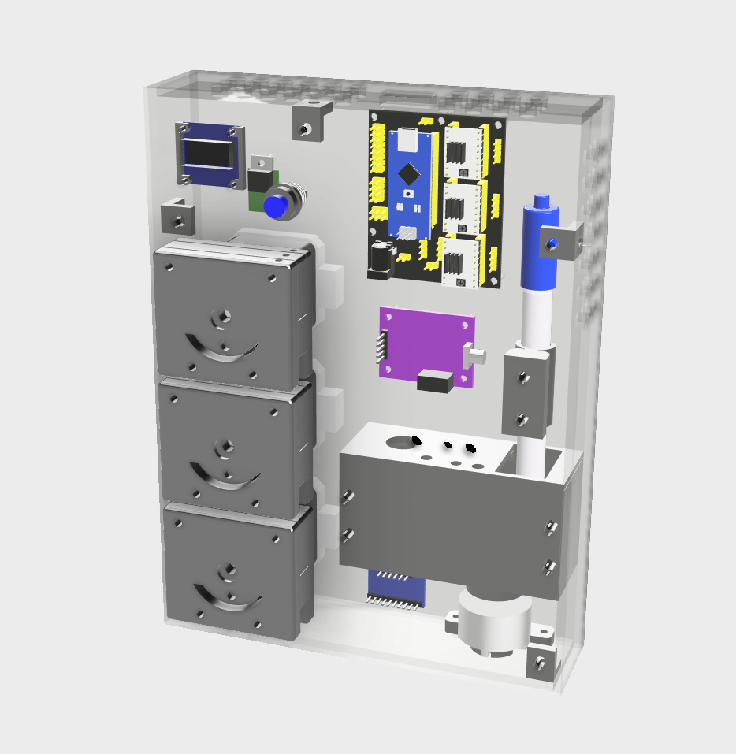

# alkabot

The Alkabot is an open-source alkalinity monitor for reef aquaria, designed for maximum accuracy using widely available electronics and 3D-printed hardware. It is significantly cheaper than commercially available alkalinity monitoring solutions, costing well under $200 (depending on part sourcing).

<a href="https://youtu.be/Ts23RznHFv8">Here's a video about the project</a>

<b>Parts:</b>

Both the main casing and the reagent reservoir are designed to be assembled from laser-cut 4mm acrylic. The part files for these (in .dxf format) can be found in the /laser directory.

The pump components, mounting brackets, reaction chamber, and other mechanical parts are designed to be 3D printed. These part files (in .stl format) can be found in the /3Dprint directory.

A full .step file for the assembly and all parts is also available in the /step directory, in case you wish to make any modifications to the design.

For non-user-manufactured parts, you can find the bill of materials under /documents.

<b>Purchasing laser-cut and 3D-printed parts:</b>

I am planning to offer packages for sale containing all user-manufacturable parts. Details will be added with the next version release.

<b>Tools and supplies:</b>

Once you have all the parts, you shouldn't need more than a screwdriver, a small hex key, and a soldering iron to complete the assembly. You'll also need graduated cylinders (ideally 10ml and 50ml) to calibrate your pumps.

<b>Software:</b>

The software to run the monitor as well as that needed to test and calibrate the pumps before operation can be found under /code.

The code assumes you have (or can set up) a working MQTT server to send the command to start the test and receive the result.

<b>Assembly instructions:</b>

See the instructions file under /documents.

<b>Warnings:</b>

This project involves using hydrochloric acid, and while the concentrations you'll be using in the Alkabot itself aren't strong enough to harm you, if you buy more concentrated acid and dilute it at home <b>you need to wear appropriate protective gear and take reasonable precautions</b>.

<b>Donations:</b>

You are free to use this design for any purpose covered by the Creative Commons Attribution-NonCommercial-ShareAlike license at no cost. However, if you'd like to contribute to the cost of ongoing development, you can donate via the PayPal and Ko-Fi buttons below. 50% of any profit I make from this project will be donated to marine conservation charities.

<b>Attribution:</b>

The pump design is based on the work of the iGEN-Aachen team, available under a Creative Commons Attribution license from https://www.thingiverse.com/thing:2619479.

<b>Version history:</b>

Version 0.9.1 (14 January 2021):

<ul><li>Added a 40mm fan mount and ventilation holes to the case parts.</li>
  <li>Swapped tank and waste pumps for better resistance to gravity siphon effect.</li>
</ul>

Version 0.9 (11 January 2021):

<ul><li>First public release.</li></ul>
